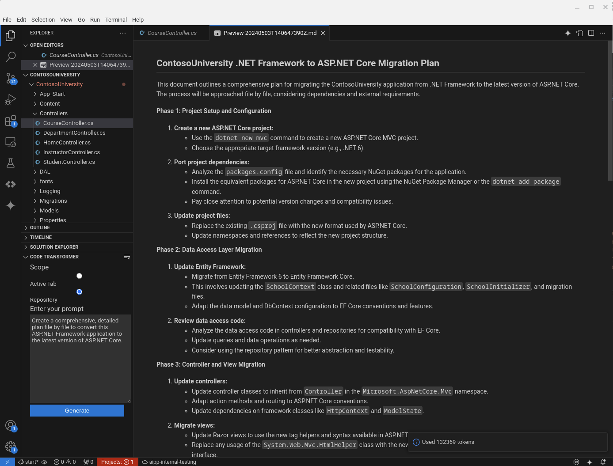
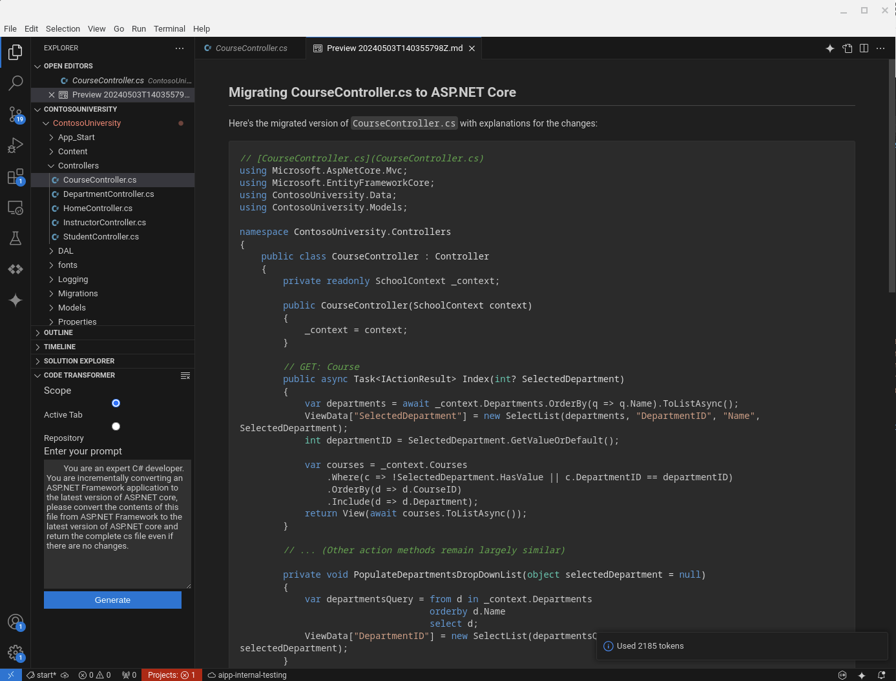

# Code Transformer

Very simple demonstration of using Gemini 1.5 Pro to transform either the current open tab or use the entire repository as context.  

## Sample using complete repository

## Sample using current open tab

Samples outputs were generated using the sample [ContosoUniversity](https://github.com/jjdelorme/ContosoUniversity) which is an old Microsoft sample of an ASP.NET Framework Application.

