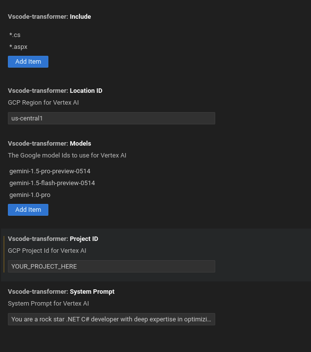

# Code Transformer

Very simple demonstration of using Gemini 1.5 Pro to transform either the current open tab or use the entire repository as context.  

## Configuration

### ADC Environment Variable
The application uses the NodeJS SDK for invoking Vertex AI with Application Default Credentials. Create a `.vscode/launch.json` file in the project root and add the following configuration for the environment variable:
```diff
	{
		"version": "0.2.0",
		"configurations": [
			{
				"name": "Run Extension",
				"type": "extensionHost",
				"request": "launch",
				"runtimeExecutable": "${execPath}",
				"args": ["--extensionDevelopmentPath=${workspaceRoot}"],
				"outFiles": ["${workspaceFolder}/out/**/*.js"],
				"preLaunchTask": "npm: watch",
+				"env": {
+					"GOOGLE_APPLICATION_CREDENTIALS": "YOUR-CREDENTIALS-JSON-HERE"
				}			
			}
		]
	}
```

###
Configure which GCP Project Id here.  You can also override the file types, system instruction and other settings specific to the `vscode-transformer` in VS Code User Settings:


## Run

To run the application, or select `Run -> Start Debugging` from your VSCode instance.

## Sample using complete repository


## Sample using current open tab


Samples outputs were generated using the sample [ContosoUniversity](https://github.com/jjdelorme/ContosoUniversity) which is an old Microsoft sample of an ASP.NET Framework Application.
